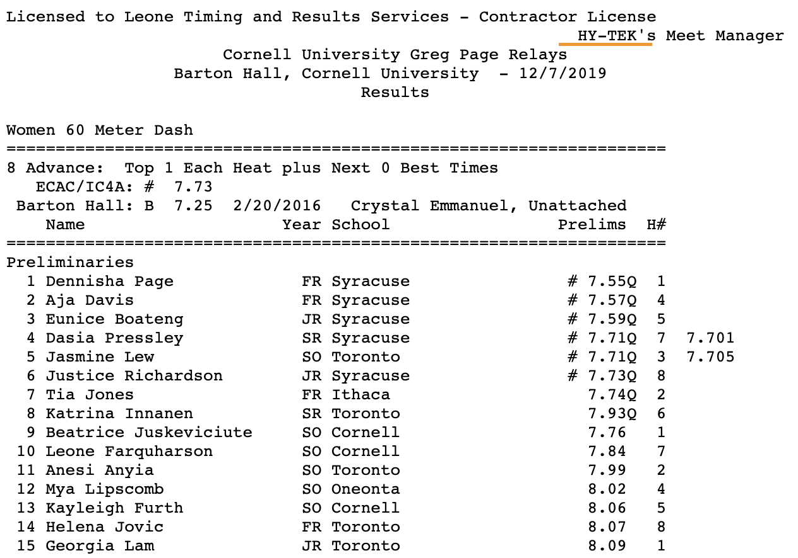
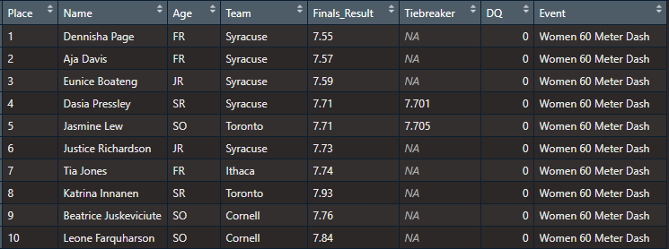
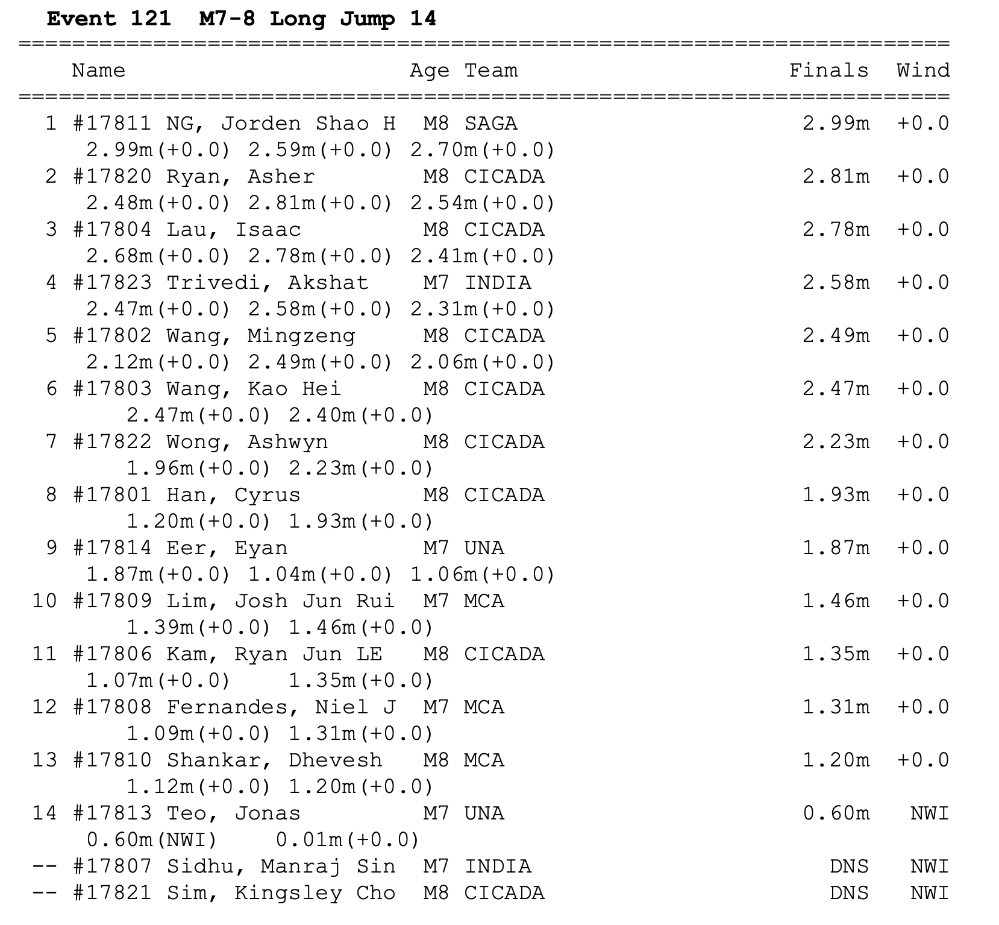
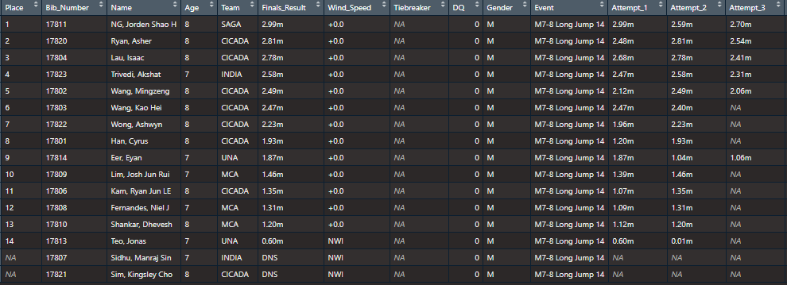
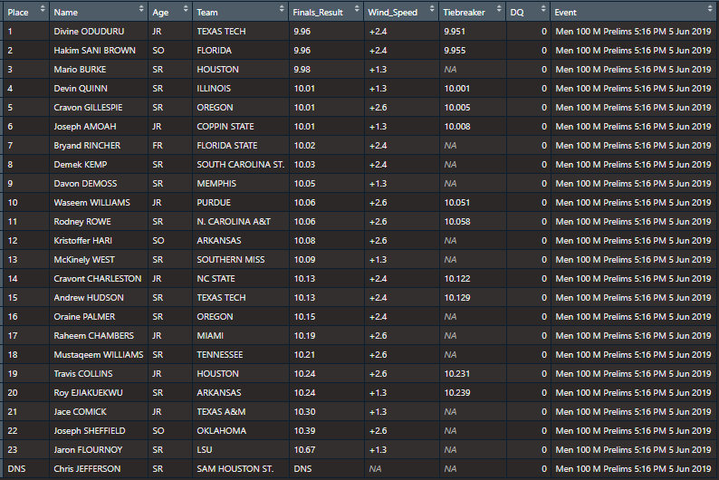

# JumpeR
JumpeR R package

### Latest Development Version from Github

`devtools::install_github("gpilgrim2670/JumpeR")`
Package is still under heavy development so development versions will be unstable.
Please wait for an upcoming CRAN release to acquire a stable version.

# Usage

Version 0.1.0 of `JumpeR` reads track and field results into `R`, similar to what the `SwimmeR` package does for swimming results.

## Supported Formats

`JumpeR` currently supports reading in *single column* Hy-tek/Active.com style results in either .html or .pdf format.  `JumpeR` also supports Flash Results style results in .pdf format (but not html).

### Hy-tek/Active.com Results
[These](http://leonetiming.com/2019/Indoor/GregPageRelays/Results.htm) are Hy-tek results in html format, from the 2019 Greg Page relays at Cornell University.  This particular file contains the entire meet.



It can be imported into `R` using `JumpeR`:
```r
tf_parse(
    read_results(
      "http://leonetiming.com/2019/Indoor/GregPageRelays/Results.htm"
    )
  )
```


[This](https://www.singaporeathletics.org.sg/download/28818/) is a Hy-tek .pdf results file, from the Singapore Masters Track and Field Assoication 2019 Championship,  This particular file contains the entire meet.



Once saved (it's included in `JumpeR` as an example) it can be imported into `R` using `JumpeR`:
```r
tf_parse(
    read_results(
      system.file("extdata", "SMTFA-2019-Full-Results.pdf", package = "JumpeR")
    ),
    attempts = TRUE
  )
```


### Flash Results

[This](https://www.flashresults.com/2019_Meets/Outdoor/06-05_NCAAOTF-Austin/001-1.pdf) is a Flash Results .pdf result, from the prelims of the 2019 NCAA Mens 100m Championships.


It can be imported into `R` using `JumpeR`:
```r
tf_parse(
    read_results(
      "https://www.flashresults.com/2019_Meets/Outdoor/06-05_NCAAOTF-Austin/001-1.pdf"
    )
  )
```


Flash Results also post .html version of results like [these](https://www.flashresults.com/2019_Meets/Outdoor/06-05_NCAAOTF-Austin/001-1_compiled.htm), which are currently *NOT* supported.


## Importing Results

`JumpeR` reads track and field results into `R` and outputs tidy dataframes.  `JumpeR` uses `read_results` to read in either a PDF or HTML file (like a url) and the `tf_parse` (for track and field) function to convert the read file to a tidy dataframe.  
### read_results
`read_results` has two arguments, `file`, which is the file path to read in, and `node`, required only for HTML files, this is a CSS selector node where the results reside.  `node` defaults to `"pre"`, which has been correct in every instance tested thus far.

### tf_parse
`tf_parse` has six arguments as of version 0.1.0.

`file` is the output of `read_results` and is required.

`avoid` is a list of strings.  Rows in `file` containing any of those strings will not be included.  `avoid` is optional.  Incorrectly specifying it may lead to nonsense rows in the final dataframe, but will not cause an error.  Nonsense rows can be removed after import.  

`typo` and `replacement` work together to fix typos, by replacing them with replacements.  Strings in `typo` will be replaced by strings in `replacement` in element index order - that is the first element of `typo` will be replaced everywhere it appears by the first element of `replacement`.  Typos can cause lost data and nonsense rows.

See `?tf_parse` or the package vignette for more information.

## Examples

```r
tf_parse(
    read_results(
      "http://results.yentiming.com/2020/Indoor/2-29-20-MOC.htm"
    )
  )
```

To capture jump/throw attempts set `attempts = TRUE`

```r
tf_parse(
    read_results(
      "http://leonetiming.com/2019/Indoor/GregPageRelays/Results.htm"
    ),
    attempts = TRUE
  )
```

# Getting help

You're welcome to contact me with bug reports, feature requests, etc. for `JumpeR`.

If you find bug, please provide a minimal reproducible example at [github](https://github.com/gpilgrim2670/JumpeR).

`JumpeR` is conceptually very similar to the `SwimmeR` package, which I also developed and maintain.  I do a lot of demos on how to use `SwimmeR` at my blog [Swimming + Data Science](https://pilgrim.netlify.app/).  `SwimmeR` also has a vignette.  Call `vignette("SwimmeR")`.  If you download from github don't forget to set `build_vignettes = TRUE`.

# Why is it called JumpeR?

1. The name RunneR was already taken on CRAN
2. I never liked running, but have always enjoyed the long jump
3. Vague memories of [this Third Eye Blind song](https://www.youtube.com/watch?v=gRYZijLZR-Q)
